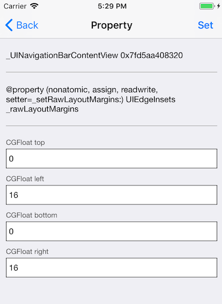
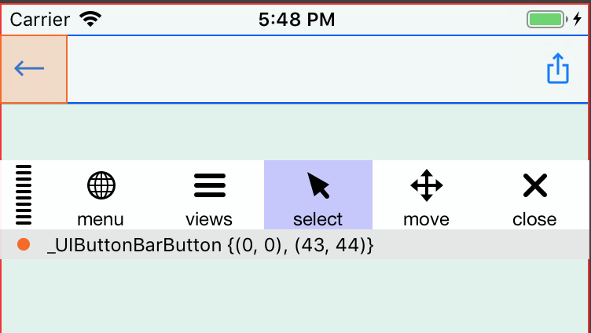
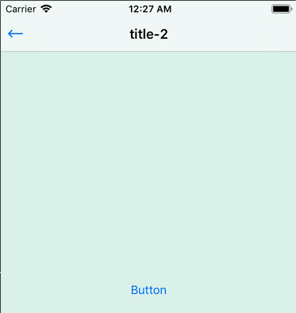
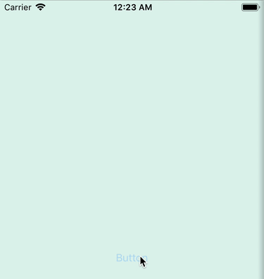
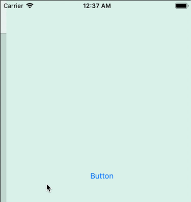

本文前半部分主要讲述 UINavigationController/UINavigationBar 一些常用的接口用法以及编程实践。后半部分会分析到 UINavigationItem 的视图层级以及导航栏切换的问题。本文的代码示例 [地址](https://github.com/YodaLuke/awesome-ios/tree/master/Awesome/Awesome/App/Navigation)

### 概述

UINavigationController，是一个容器类（命名上，UIKit 中容器类一般以 Controller 后缀结束），对 ViewController 进行管理（利用栈的方式）。

```swift
open class UINavigationController : UIViewController {
    open var viewControllers: [UIViewController]
}
```

UINavigationBar，是 UINavigationController 顶部的导航栏，主要负责 UI 的展示，并对 navigationItem 进行管理。

```swift
open class UINavigationController : UIViewController {
    open var navigationBar: UINavigationBar { get }
}
```

UINavigationItem 是 UINavigationBar 上显示的具体元素的一个抽象类，通过 ViewController 的拓展添加了一个 navigationItem，把 UINavigationItem 交由 ViewController 管理。

```swift
extension UIViewController {    
    open var navigationItem: UINavigationItem { get }
}
```

### UINavigationBar

为了统一定制 UINavigationBar 的 UI，通常的做法子类化 UINavigationController，并设置其中的 UINavigationBar：

```swift
class NavigationController: UINavigationController {}	
```

#### 设置

常见的 UINavigationBar 设置项包括：


```swift
func setupNavigationBar() {
    // default: 灰色背景 白色文字 black: 纯黑色背景 白色文字，会被👇的设置项覆盖
    navigationBar.barStyle = .black    
    // 标题的样式
    navigationBar.titleTextAttributes = [NSAttributedString.Key.font: UIFont.systemFont(ofSize: 16, weight: .medium)]
    // 标题的垂直位置偏移量
    navigationBar.setTitleVerticalPositionAdjustment(0, for: .default)    
    // UIBarButtonItem 上的控件颜色，默认为按钮的蓝色
    navigationBar.tintColor = .black    
    // 是否半透明效果
    navigationBar.isTranslucent = true
    // 背景颜色(会使 isTranslucent = true 失效)
    navigationBar.barTintColor = .white
    // 设置背景图片(会使 barTintColor，isTranslucent = true 失效)
    navigationBar.setBackgroundImage(UIImage(named: "trello"), for: .default)
}
```

#### 分割线

关于分割线，通过 shadowImage 或 clipsToBounds 可以去掉。

```swift
func hideBottomLine() {
    // 设置底部分割线，如果传入 UIImage() 可以去掉分割线。
    navigationBar.shadowImage = UIImage(color: .red, size: CGSize(width: navigationBar.width, height: 0.5))
    navigationBar.shadowImage = UIImage()    
    // 去掉分割线的另外一种方式（会影响到 statusBar，不建议使用这个属性）
    navigationBar.clipsToBounds = true
}
```

### UINavigationItem

UINavigationItem 其实并不是 UIView，它是一个 NSObject，所以它是一个管理类。

#### title/prompt

设置标题:

```swift
func setupNavigationItem() {
    // 设置标题，等效 self.title
    navigationItem.title = "title-\(navigationController?.children.count ?? 0)"
    // 设置提示
    navigationItem.prompt = "prompt"
}
```

效果如下：


#### backBarButtonItem

navigationItem 默认有一个 backBarButtonItem，如下图。

其文本默认为上一个 ViewController 的标题，如果上一个 ViewController 没有标题，则为 Back（中文环境下为 「返回」）

可以点击回到上一个控制器。可以通过设置 hidesBackButton 隐藏：

```swift
open var backBarButtonItem: UIBarButtonItem? 
open var hidesBackButton: Bool
```

#### BarButtonItem

设置左右 BarButtonItem：

```swift
func addNavigationItem() {    
    let backItem = UIBarButtonItem(title: "Cancel", style: .plain, target: self, action: #selector(backAction))
    let shareItem = UIBarButtonItem(image: UIImage(named: "share"), style: .done, target: self, action: #selector(shareAction))
    navigationItem.leftBarButtonItem = backItem
    navigationItem.rightBarButtonItem = shareItem
}
```


注意如果设置了 leftBarButtonItem，会使得原本的 backBarButtonItem 失效，并且同时使边缘的返回手势失效。这个问题可以使用继承或 Runtime 解决，Runtime 可参考：[SwipeBack -OC](https://github.com/devxoul/SwipeBack)

使用继承的解决方案如下：

```swift
class NavigationController: UINavigationController {    
    var enablePopGesture = true    
    override func viewDidLoad() {
        super.viewDidLoad()
        interactivePopGestureRecognizer?.delegate = self
    }
}
```

UIGestureRecognizerDelegate：

```swift
extension NavigationController: UIGestureRecognizerDelegate {    
    func gestureRecognizer(_ gestureRecognizer: UIGestureRecognizer, shouldReceive press: UIPress) -> Bool {
        return enablePopGesture
    }
}
```

不过上面的解决方案是有点问题的，可以试着在 rootViewController 一直尝试边缘手势返回操作，然后再继续正常操作，你会发现页面出现假死现象。原因是 navigationController.viewControllers 的 count 值为  1，滑动时没有上层控制器，系统不知如何处理，所以会出现假死。

解决方案：

```swift
class NavigationController: UINavigationController {        
    override func viewDidLoad() {
        super.viewDidLoad()
        delegate = self
    }
}
```

```swift
extension NavigationController: UINavigationControllerDelegate {
    func navigationController(_ navigationController: UINavigationController, didShow viewController: UIViewController, animated: Bool) {
        guard let interactivePopGestureRecognizer = interactivePopGestureRecognizer else { return }
        interactivePopGestureRecognizer.isEnabled = navigationController.children.count > 1
        if navigationController.children.count == 1 {
            interactivePopGestureRecognizer.isEnabled = false
        } else {
            interactivePopGestureRecognizer.isEnabled = enablePopGesture
        }
    }
}
```

如果想 backBarButtonItem 和 leftBarButtonItem 共存的话，可以设置 leftItemsSupplementBackButton = true。

```swift
navigationItem.leftItemsSupplementBackButton = true
```


不过 backBarButtonItem 一般情况下是比较少用到的，因为存在比较难自定义 UI 的问题（图片，文字的修改）。所以通常的做法是在 NavigationController 统一处理返回按钮的 UI，如果存在上一级控制器，就显示 leftBarButtonItem:

```swift
override func pushViewController(_ viewController: UIViewController, animated: Bool) {
    setupDefaultBackItem(push: viewController)
    super.pushViewController(viewController, animated: animated)
}
    func setupDefaultBackItem(push viewController: UIViewController) {
    if viewControllers.count > 0 && (viewController.navigationItem.leftBarButtonItem == nil) {
        viewController.hidesBottomBarWhenPushed = true
        let backBarButtonItem = UIBarButtonItem(image: UIImage(named: "back"), style: .plain,
                                                target: self, action: #selector(backAction))
        viewController.navigationItem.leftBarButtonItem = backBarButtonItem
    }
}
```

#### BarButtonItems

 #### 视图层级

UINavigationBar 在 iOS 的几个版本中一直在持续变化，导致了一些奇怪的问题，例如控件之间的间距难以统一等。为了解决这个问题，先来看看 UINavigationBar 的视图层级。

定义一个打印视图层级的函数, 在 viewDidAppear() 中调用：

```swift
extension UIView {
    func logSubView(_ level: Int) {
        if subviews.isEmpty { return }
        for subView in subviews {
            var blank = ""
            for _ in 1..<level {
                blank += " "
            }
            if let className = object_getClass(subView) {
                print( blank + "\(level): " + "\(className)" + "\(subView.frame)")
            }
            subView.logSubView(level + 1)
        }
    }
}
```

```swift
override func viewDidAppear(_ animated: Bool) {
    super.viewDidAppear(animated)
    navigationController!.navigationBar.logSubView(1)
}
```

先打印上面 addNavigationItem() 的版本，再把 backItem 用 image 实现进行打印：

```swift
func addNavigationItem() {
        let backItem = UIBarButtonItem(image: UIImage(named: "back"), style: .done, target: self, action: #selector(backAction))
        let shareItem = UIBarButtonItem(image: UIImage(named: "share"), style: .done, target: self, action: #selector(shareAction))
        navigationItem.leftBarButtonItem = backItem
        navigationItem.rightBarButtonItem = shareItem
    }
```

打印结果如下：

iOS11-iOS12：

```swift
1: _UINavigationBarContentView(0.0, 0.0, 375.0, 44.0)
 2: _UIButtonBarStackView(8.0, 0.0, 66.0, 44.0)
  3: _UIButtonBarButton(0.0, 0.0, 66.0, 44.0)
   4: _UIModernBarButton(8.0, 9.0, 58.0, 23.5)
    5: UIButtonLabel(0.0, 3.0, 55.0, 20.5)
 2: _UIButtonBarStackView(324.0, 0.0, 43.0, 44.0)
  3: _UIButtonBarButton(0.0, 0.0, 43.0, 44.0)
   4: _UIModernBarButton(11.0, 9.5, 24.0, 24.0)
    5: UIImageView(0.0, 0.0, 24.0, 24.0)

1: _UINavigationBarContentView(0.0, 0.0, 375.0, 44.0)
 2: _UIButtonBarStackView(8.0, 0.0, 43.0, 44.0)
  3: _UIButtonBarButton(0.0, 0.0, 43.0, 44.0)
   4: _UIModernBarButton(8.0, 9.5, 24.0, 24.0)
    5: UIImageView(0.0, 0.0, 24.0, 24.0)
 2: _UIButtonBarStackView(324.0, 0.0, 43.0, 44.0)
  3: _UIButtonBarButton(0.0, 0.0, 43.0, 44.0)
   4: _UIModernBarButton(11.0, 9.5, 24.0, 24.0)
    5: UIImageView(0.0, 0.0, 24.0, 24.0)
```

iOS 10:

```swift
1: UINavigationButton(16.0, 7.0, 53.0, 30.0)
 2: UIButtonLabel(0.0, 5.0, 53.0, 20.5)
1: UINavigationButton(324.0, 6.0, 46.0, 30.0)
 2: UIImageView(11.0, 3.0, 24.0, 24.0)

1: UINavigationButton(5.0, 6.0, 46.0, 30.0)
 2: UIImageView(11.0, 3.0, 24.0, 24.0)
1: UINavigationButton(324.0, 6.0, 46.0, 30.0)
 2: UIImageView(11.0, 3.0, 24.0, 24.0)
```

iOS 9:

```swift
1: UINavigationButton(8.0, 7.0, 53.0, 30.0)
 2: UIButtonLabel(0.0, 5.0, 53.0, 20.5)
1: UINavigationButton(324.0, 6.0, 46.0, 30.0)
 2: UIImageView(11.0, 3.0, 24.0, 24.0)

1: UINavigationButton(5.0, 6.0, 46.0, 30.0)
 2: UIImageView(11.0, 3.0, 24.0, 24.0)
1: UINavigationButton(324.0, 6.0, 46.0, 30.0)
 2: UIImageView(11.0, 3.0, 24.0, 24.0)
```

用 Flex 也可以方便查看：


可以看出，iOS9-> iOS10 ，UIBarButtonItem 生成了一个 UINavigationButton。在从 title 初始化的时候， origin.x 从 8.0->16.0，从 image  初始化的时候不变。而到了 iOS11/iOS12，直接变成了 UIButtonBarButton，并且成为了 UIButtonBarStackView 的子控件，由 AutoLayout 管理。可以看到 9-12 的版本迭代中，UIBarButtonItem 都产生了变化，特别是 iOS11 采用了自动布局，这也带来了不少坑。

#### 边距问题

基于上面的讨论，想要调整 BarButtonItem 的位置，变成了一件需要特殊处理的事情。例如，我们尝试将  origin.x 调整为一个统一的位置。

**通过 fixedSpace 来处理**：

```swift
func addFixedNavigationItems() {
    let backItem = UIBarButtonItem(image: UIImage(named: "back"), style: .done, target: self, action: #selector(shareAction))
    addLeftItem(by: backItem, fix: -5)
}
    
func addLeftItem(by item: UIBarButtonItem, fix: CGFloat) {
    let fixItem = UIBarButtonItem(barButtonSystemItem: .fixedSpace, target: nil, action: nil)
    fixItem.width = fix
    navigationItem.leftBarButtonItems = [fixItem, item]
}
```

结果如下：


可以发现在 iOS11 中，因为采用了自动布局的缘故，fixedSpace 不再起作用

另外一个思路是 **通过 UIbutton 创建一个 customView**，然后设置为 UIBarButtonItem 的 customView，并通过设置其 contentEdgeInsets 等调整间距。（因为 UIBarButtonItem，UIBarItem 和 UINavigationItem 一样都只是 NSObject，只起到管理类的作用，并没有 UIView 的属性可以设置 ）

```swift
final class CustomBarButtonItem: UIBarButtonItem {    
    lazy var button = UIButton()    
    init(image: UIImage?, title: String?) {
        super.init()
        setButton(image: image, title: title)
    }    
    required init?(coder aDecoder: NSCoder) {
        fatalError("init(coder:) has not been implemented")
    }    
    private func setButton(image: UIImage?, title: String? = nil) {
        if let image = image {
            button.setImage(image.withRenderingMode(.alwaysTemplate), for: .normal)
        }
        button.setTitle(title, for: .normal)
        button.tintColor = tintColor
        button.contentEdgeInsets = UIEdgeInsets(top: 3, left: -3, bottom: 3, right: 10)
        button.imageView?.contentMode = .scaleAspectFill
        button.sizeToFit()
        customView = button
    }
}
```

```swift
func addNavigationItemByCustomView(){
    let backItem = CustomBarButtonItem(image: UIImage(named: "back"), title: nil)
    navigationItem.leftBarButtonItem = backItem
}
```

结果是这样的：


可以看出视觉效果上看起来对了，但左边边距依然没有消失，而且图片的位置给人一种错觉，认为图片的位置是按钮中心，当用户点击到左边边距区域，就超出了按钮的点击范围。

其实，一个有效的做法是**通过 swizzle 来修改 layoutMargins**, 这个属性是用来设置内边距的。



可以看出，UINavigationBarContentView 的 layoutMargins 中左右边距都是 16，所以可以通过 swizzle layoutSubviews 这个方法来修改这个属性。

如下，swizzle layoutSubviews：

```swift
private let swizzling: (AnyClass, Selector, Selector) -> () = { forClass, originalSelector, swizzledSelector in
    guard
        let originalMethod = class_getInstanceMethod(forClass, originalSelector),
        let swizzledMethod = class_getInstanceMethod(forClass, swizzledSelector)
        else { return }
    method_exchangeImplementations(originalMethod, swizzledMethod)
}

extension UINavigationBar {
    static func swizzedMethod()  {
        swizzling(
            UINavigationBar.self,
            #selector(UINavigationBar.layoutSubviews),
            #selector(UINavigationBar.swizzle_layoutSubviews))
    }
    
    @objc func swizzle_layoutSubviews() {
        swizzle_layoutSubviews()        
        layoutMargins = .zero
        for view in subviews {
            if NSStringFromClass(view.classForCoder).contains("ContentView") {
                view.layoutMargins = UIEdgeInsets(top: 0, left: 8, bottom: 0, right: 8)
            }
        }
    }
}
```

重写 UIApplication 中的 next ，然后将 swizzle 操作放在这里：[参考](https://stackoverflow.com/questions/39562887/how-to-implement-method-swizzling-swift-3-0/39562888)

```swift
extension UIApplication {
    private static let classSwizzedMethodRunOnce: Void = {
        if #available(iOS 11.0, *) {
            UINavigationBar.swizzedMethod()
        }
    }()
    
    open override var next: UIResponder? {
        UIApplication.classSwizzedMethodRunOnce
        return super.next
    }
}
```

大功告成：



### 全屏手势返回


### 过渡效果

滑动返回手势在系统的默认效果中，是有一个动画效果的，在切换过程中，会有一个背景颜色、titleView,左右 item 透明度渐变的过程。如下：



然而，出现**有导航栏和没有导航栏之间控制器的切换**(也可以当作透明导航栏和不透明导航栏的切换)时，就会有不自然的过渡效果（不自然指的是没有跟随手势的变化百分比渐变，而是突然消失或出现）：

如下：

```swift
class HomeViewController: UIViewController, StoryboardBased {
    override func viewWillAppear(_ animated: Bool) {
        navigationController?.isNavigationBarHidden = false
    }
}
class PushToViewController: UIViewController, StoryboardBased {
    override func viewWillAppear(_ animated: Bool) {
        navigationController?.isNavigationBarHidden = true
    }
}
```




#### 方案1

第一种解决方案很简单，也是大部分 app 采用的做法，如下：

```swift
class HomeViewController: UIViewController, StoryboardBased {
    override func viewWillAppear(_ animated: Bool) {
        navigationController?.setNavigationBarHidden(false, animated: true)
    }
}
class PushToViewController: UIViewController, StoryboardBased {
    override func viewWillAppear(_ animated: Bool) {
        navigationController?.setNavigationBarHidden(true, animated: true)
    }
}
```



如果 PushToViewController 需要显示透明的导航栏（上面有返回按钮等但背景是透明的），就再自定义一个 View 代替原先的 NavigationBar，这个方案总体是相对简单并且几乎没有什么 bug。

#### 方案2

方案1 的缺点是过渡效果会比较生硬，与系统的返回效果有差距。QQ 的过渡效果还不错，方案2来研究如何实现。

